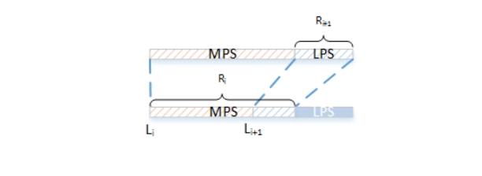

# brunsli代码分析—ANS与算数编码

## ANS理论

[ANS理论分析](https://bjlkeng.github.io/posts/lossless-compression-with-asymmetric-numeral-systems/)

## ANS编码

$$
C\left(x_{i}, s_{i+1}\right)=\left\lfloor\frac{x_{i}}{f_{s}}\right\rfloor \cdot 2^{n}+C D F[s]+\left(x_{i} \bmod f_{s}\right)
$$


```C++

class ANSCoder {
 public:
  //初始化ANSCoder时将state设置为一个标志位，解码端解码到最后如果不是这个标志位则解码失败
  ANSCoder() : state_(BRUNSLI_ANS_SIGNATURE << 16) {}
//ANS编码函数，只有在当前state需要标准化的情况下需要输出，nbits = 16，并且将后16位输出
  uint32_t PutSymbol(const ANSEncSymbolInfo t, uint8_t* nbits) {
    uint32_t bits = 0;
    *nbits = 0;
  //当state数值太大，利用编码公式输出结果会超过32位所表示的范围，所以将低16位输出，高位右移16位
    if ((state_ >> (32 - BRUNSLI_ANS_LOG_TAB_SIZE)) >= t.freq_) {
      bits = state_ & 0xffff;
      state_ >>= 16;
      *nbits = 16;
    }
	//利用编码公式计算下一个state
    state_ = ((state_ / t.freq_) << BRUNSLI_ANS_LOG_TAB_SIZE) +
             (state_ % t.freq_) + t.start_;
    return bits;
  }

  uint32_t GetState() const { return state_; }

 private:
  uint32_t state_;
};
```

$$
s_{i+1}=\operatorname{symbol}\left(x_{i+1} \bmod 2^{n}\right) \text { such that } C D F[s] \leq x_{i+1} \bmod 2^{n}<C D F[s+1]\newline
x_{i}=D\left(x_{i+1}\right)=f_{s} \cdot\left\lfloor x_{i+1} / 2^{n}\right\rfloor-C D F[s]+\left(x_{i+1} \bmod 2^{n}\right)
$$

```C++
class ANSDecoder {
 public:
  ANSDecoder() {}

  void Init(WordSource* in) {
    state_ = in->GetNextWord();
    state_ = (state_ << 16u) | in->GetNextWord();
  }

  int ReadSymbol(const ANSDecodingData& code, WordSource* in) {
    //取模操作，通过res可以获得当前symbol，CDF[symbol]
    const uint32_t res = state_ & (BRUNSLI_ANS_TAB_SIZE - 1);
    const ANSSymbolInfo& s = code.map_[res];
    //将原始公式中取模减去累积分布函数转换为一个查表操作，code.map_大小为1<<BRUNSLI_ANS_TAB_SIZE
    state_ = s.freq_ * (state_ >> BRUNSLI_ANS_LOG_TAB_SIZE) + s.offset_;
    //当解码端state小于1<<16时，原始state左移16位，码流中输出16位填补到state低16位中
    if (state_ < (1u << 16u)) {
      state_ = (state_ << 16u) | in->GetNextWord();
    }
    return s.symbol_;
  }
  //检查解码最后是否为标志位，判断解码是否出错
  bool CheckCRC() const { return state_ == (BRUNSLI_ANS_SIGNATURE << 16u); }

 private:
  uint32_t state_;
};
```

state_ = s.freq_ * (state_ >> BRUNSLI_ANS_LOG_TAB_SIZE) + s.offset_;

s.offset_通过查表实现

s.freq_ * (state_ >> BRUNSLI_ANS_LOG_TAB_SIZE)如果需要查表实现的话，需要2^10^*2^16^大小的表格

## 自适应二进制算数编码



```C++
 void AddBit(Prob* p, int bit) {
    //获取概率信息
    const uint8_t prob = p->get_proba();
    //更新概率信息，利用利用FastDivide而不是除法更新其中的prob
    p->Add(bit);
    //编码只需要一次除法即可
    const uint32_t diff = high_ - low_;
    const uint32_t split = low_ + (((uint64_t)diff * prob) >> 8);
    if (bit) {
      low_ = split + 1;
    } else {
      high_ = split;
    }
    //当low和high表示的区间太小时，对区间进行标准化
    if (((low_ ^ high_) >> 16) == 0) {
      words.push_back(high_ >> 16);
      low_ <<= 16;
      high_ <<= 16;
      high_ |= 0xffff;
    }
  }
```

```C++
  int ReadBit(int prob, WordSource* in) {
    const uint32_t diff = high_ - low_;
    const uint32_t split = low_ + (((uint64_t)diff * prob) >> 8u);
    int bit;
    if (value_ > split) {
      low_ = split + 1;
      bit = 1;
    } else {
      high_ = split;
      bit = 0;
    }
    if (((low_ ^ high_) >> 16u) == 0) {
      value_ = (value_ << 16u) | in->GetNextWord();
      low_ <<= 16u;
      high_ <<= 16u;
      high_ |= 0xFFFFu;
    }
    return bit;
  }
```

## 自适应算数编码


$$
\begin{array}{c}
\text { low }=l o w+(h i g h-l o w) * L \\
h i g h=l o w+(\text { high }-\text { low }) * H
\end{array}
$$
拆解开来一步一步看：

1. 刚开始编码区间是 [0，1)，即
   $$
   \begin{array}{l}
   \text { low }=0 \\
   \text { high }=1
   \end{array}
   $$
   
2. 第一个字符A的概率区间是 [0，0.2)，则 *L* = 0，*H* = 0.2，更新
   $$
   \begin{array}{l}
   \text { low }=\text { low }+(\text { high }-\text { low }) * L=0 \\
   \text { high }=\text { low }+(\text { high }-\text { low }) * H=0.2
   \end{array}
   $$
   
3. 第二个字符R的概率区间是 [0.6，1)，则 *L* = 0.6，*H* = 1，更新
   $$
   \begin{array}{l}
   \text { low }=\text { low }+(\text { high }-\text { low }) * L=0.12 \\
   \text { high }=\text { low }+(\text { high }-\text { low }) * H=0.2
   \end{array}
   $$
   
4. 第三个字符B的概率区间是 [0.2，0.4)，则 *L* = 0.2，*H* = 0.4，更新
   $$
   \begin{array}{l}
   \text { low }=\text { low }+(\text { high }-\text { low }) * L=0.136 \\
   \text { high }=\text { low }+(\text { high }-\text { low }) * H=0.152
   \end{array}
   $$

## 总结

* brunsli内部的代码在设计的时候考虑到了算数编码在多符号状态下计算量大的情况，所以对于必须使用多符号编码的情况使用ANS编码来代替算数编码。
* ANS编码相比较于多符号的算数编码只需要进行一次乘数法，并且不需要进行概率更新，导致其编码速度远高于算数编码。但是由于其概率分布无法做到精确小数，所以其编码效率略低于算数编码。
* ANS编码相比较二进制算术编码，计算复杂度与其相当，只使用了一次乘除法，并且brunsli代码在设计的时候对其二进制算数编码的概率更新进行了优化，其概率是[0,255]范围内的整数，通过>>8来类似小数，编码效率只可能接近最优，但是大大提高了概率更新和乘除法的效率。

# brunsli代码分析—Histogram直方图

## Calculate_Ctx

上下文的计算影响因素：

1. num_components（DC,AC），当前待编码的码元所处的分量
2. prev_is_nonzero（DC,AC），之前已经编码的码元的条件，类似的还有prev_is_nonempty，prev_sgn，prev_abs
3. location（AC），当前码元在块中所处的位置
4. non_zero(AC)，当前分量非零个数的多少

***WHY？***

> 当随机分布为均匀分布时，熵最大，平均码长最长。
>
> 统计上下文信息，让上下文类似的待编码码字放入同一个直方图，使直方图分布不均匀，减小平均码长。

***HOW***


## Addcode

```c++
void DataStream::AddCode(size_t code, size_t index, EntropySource* s) {
    CodeWord word;
    word.context = static_cast<uint32_t>(index);
    word.code = static_cast<uint32_t>(code);
    word.nbits = 0;
    word.value = 0;
    BRUNSLI_DCHECK(pos_ < code_words_.size());
    code_words_[pos_++] = word;
    s->AddCode(code, index);
}
```


## PrepareEntropyCodes

***why?***

> 直方图需要被编码到码流中，虽然直方图越多，压缩率可能会越好，但是编码直方图所需的码流就要增加，所以两者需要折衷，brunsli代码中设置了编码直方图最大个数为256

***HOW***

> 将类似的直方图进行合并操作
>
> context_map作用：主要是为了解码端能够找到当前ctx所对应的直方图索引。在编码端和解码端，计算出的ctx对应的是没有经过合并后的直方图索引，在经过合并后，需要context_map来建立一个从未合并直方图到合并后直方图的映射


## BuildAndStoreEntropyCodes

```C++
void BuildAndStoreANSEncodingData(const int* histogram, ANSTable* table,
                                  Storage* storage) {
  int num_symbols;
  int symbols[kMaxNumSymbolsForSmallCode] = {0};
  std::vector<int> counts(histogram, histogram + BRUNSLI_ANS_MAX_SYMBOLS);
  int omit_pos = 0;  // Initialization is not necessary, but makes MSAN happy.
  //将直方图中各个数字出现的频次根据概率量化到1024
  NormalizeCounts(&counts[0], &omit_pos, BRUNSLI_ANS_MAX_SYMBOLS,
                  BRUNSLI_ANS_LOG_TAB_SIZE, &num_symbols, symbols);
  ANSBuildInfoTable(&counts[0], BRUNSLI_ANS_MAX_SYMBOLS, table->info_);
  EncodeCounts(&counts[0], omit_pos, num_symbols, symbols, storage);
}
void ANSBuildInfoTable(const int* counts, int alphabet_size,
                       ANSEncSymbolInfo info[BRUNSLI_ANS_MAX_SYMBOLS]) {
  int total = 0;
  for (int s = 0; s < alphabet_size; ++s) {
    const uint32_t freq = counts[s];
    info[s].freq_ = counts[s];
    info[s].start_ = total;
    total += freq;
  }
}
```

$$
C\left(x_{i}, s_{i+1}\right)=\left\lfloor\frac{x_{i}}{f_{s}}\right\rfloor \cdot 2^{n}+C D F[s]+\left(x_{i} \bmod f_{s}\right)
$$


# brunsli代码分析—DecodeAC数据结构

## AcBlockCookie

``` C++
/** All the necessary things for decoding AC block. */
struct AcBlockCookie {
  //当前块所在的位置信息
  int x;
  int y;
  //组合二进制直方图索引offset
  int Combine_index;
  //二进制直方图索引offset
  int Binary_index;
  //原始的context_map
  const uint8_t* BRUNSLI_RESTRICT original_context_map;
  //三个预测数组
  //长度为block_width的数组
  uint8_t* prev_num_nonzeros;
  //长度为kDCTBlockSize * (block_width + 1)
  int* prev_sgn;
  //长度为kDCTBlockSize * 2 * (w + 3)
  int* prev_abs;
	
  //WordSource类封装了一个指向码流的指针，当前编码所在位置，编码长度
  WordSource* in;
  //封装了state状态信息，
  ANSDecoder* ans;
  BitSource* br;
  //当前块所在的系数矩阵
  coeff_t* coeffs;
  //当前块上方块所在的系数矩阵
  const coeff_t* prev_row_coeffs;
  //当前块左边块所在的系数矩阵
  const coeff_t* prev_col_coeffs;
  //kDCTBlockSize长度的编码顺序数组
  const uint32_t* order;
  //use_legacy_context_model 长度64
  const uint8_t* context_modes;
  int prev_row_delta;

  size_t context_bits;
  const uint8_t* context_map;
  //长度Num_histograms * BRUNSLI_ANS_TAB_SIZE
  const ANSDecodingData* entropy_codes;
};
```

## ANSDecodingData

```	C++
struct ANSDecodingData {
  ANSDecodingData() {}
  
  bool Init(const std::vector<uint32_t>& counts);
  
  ANSSymbolInfo map_[BRUNSLI_ANS_TAB_SIZE];
};
typedef struct {
  uint16_t offset_;
  uint16_t freq_;
  uint8_t symbol_;
} ANSSymbolInfo;
```


![image-20220418133458058](C:\Users\Pluto\AppData\Roaming\Typora\typora-user-images\image-20220418133458058.png


